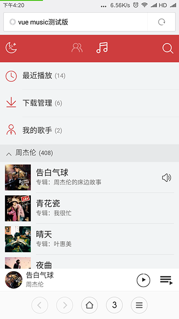
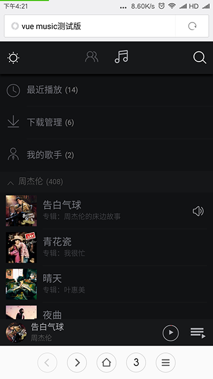
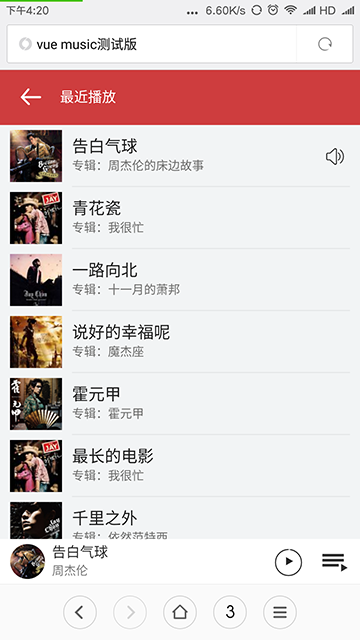
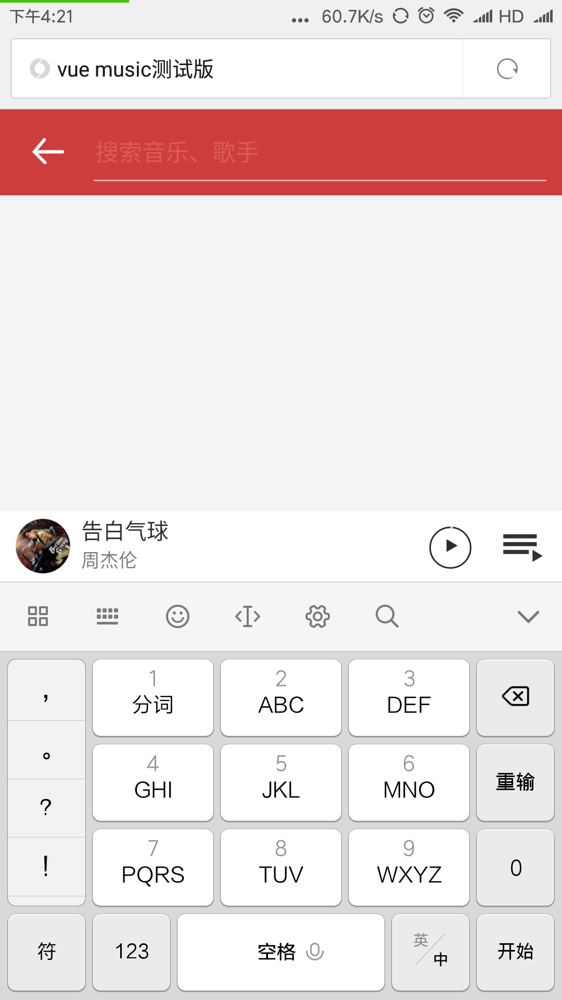
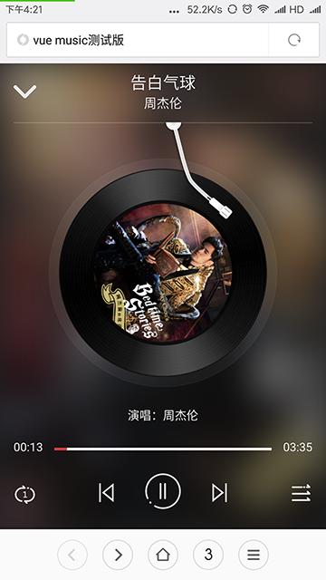
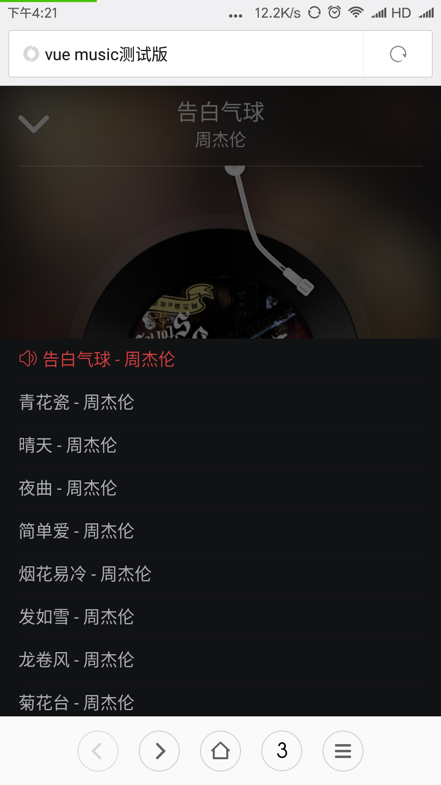
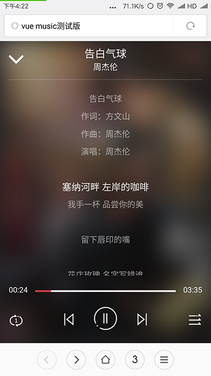

# vue_music

>  为了学习vue，做一个移动端播放器，界面抄网易云音乐的，边写代码边听歌，让学习vue不枯燥。

*持续更新*

雏形预览：  

  
  
  
  
  
  
  

## Build Setup

``` bash
# install dependencies
npm install

# serve with hot reload at localhost:8080
npm run dev

# build for production with minification
npm run build

# build for production and view the bundle analyzer report
npm run build --report
```

For detailed explanation on how things work, checkout the [guide](http://vuejs-templates.github.io/webpack/) and [docs for vue-loader](http://vuejs.github.io/vue-loader).